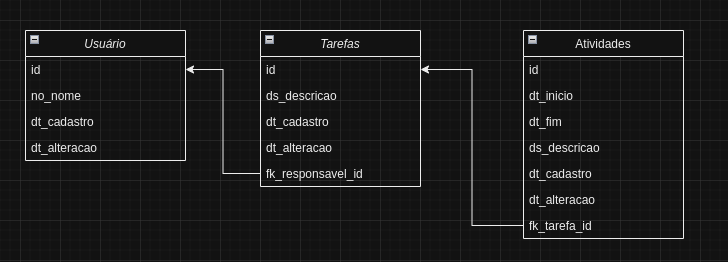

# Gestão API

Api para registro de tarefas e horas trabalhadas


## Requisitos
- Python 3.13
- Poetry 1.8.3

## Uso
```bash
# Instalar as dependêcias
poetry install

# Ativar ambiente virtual
poetry shell

# Criar tabelas do banco de dados
poetry run python manage.py migrate

# Iniciar api
poetry run python manage.py runserver
```

## Banco de dados
É usado o sqlite


